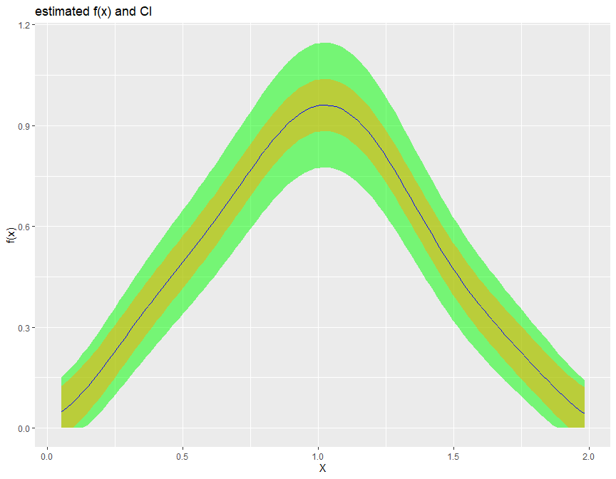

# rbbnp

A Bias Bound Approach to Non-parametric Inference

This is an affiliated package for Susanne M Schennach, A Bias Bound Approach to Non-parametric Inference, *The Review of Economic Studies*, Volume 87, Issue 5, October 2020, Pages 2439–2472, <https://doi.org/10.1093/restud/rdz065>

*version 0.3.0*

### Build up the package for your first time to use

Example: See the help documentation of a function

```         
?biasBound_density
```

### Load package

``` r
library(rbbnp)
```

### Example Code

#### Loading Sample data

``` r
# Generate sample dataset
X = gen_sample_data(size = 1000, dgp = "2_fold_uniform", seed = 123456)
Y = -X^2 + 3*X + rnorm(1000)*X
```

For Stata/SAS/SPSS format dataset, one can use the `haven` package to load the dataset.

``` r
# Example for loading the Stata file
library(haven)
sample_data <- read_dta(file.path(EXT_DATA_PATH, "sample_data.dta"))
sample_data
# A tibble: 1,000 × 2
#        X     Y
#    <dbl> <dbl>
#  1 1.09  2.83 
#  2 1.63  2.01 
#  3 1.23  3.35 
#  4 1.07  1.95 
#  5 0.844 1.39 
#  6 0.879 1.95 
#  7 1.49  1.62 
#  8 0.699 2.04 
#  9 1.38  0.528
# 10 0.866 2.83 
# ℹ 990 more rows
# ℹ Use `print(n = ...)` to see more rows
```

#### 1. Density estimation `biasBound_density()` function

If `x` is specified it will return the point estimation

``` r
biasBound_density(X = X, x = 1, h = 0.09, alpha = 0.05, if_plot_ft = TRUE, kernel.fun = "Schennach2004")
# $est_Ar
# est_A    est_r 
# 4.297778 1.998942 
# 
# $b1x
# [1] 0.1270842
# 
# $ft_plot
# 
# $f1x
# [1] 0.9598753
# 
# $CI
# lb        ub 
# 0.7245948 1.1951559 
```


If not, it returns the estimation over the whole range of X

``` r
biasBound_density(X = X, h = 0.09, alpha = 0.05, if_plot_ft = TRUE, kernel.fun = "Schennach2004")
```


#### 2. Conditional Mean estimation `biasBound_condExpectation()` function

If `x` is specified, it returns the point estimation of $E(Y|X = x)$

``` r
biasBound_condExpectation(Y = Y, X = X, x = 1, h = 0.09, alpha = 0.05, kernel.fun = "Schennach2004")

# $conditional_mean_yx
# [1] 2.001679
# 
# $CI
# lb       ub 
# 1.501453 2.609014 
```

If not, it returns the estimation over the whole range of X

``` r
biasBound_condExpectation(Y = Y, X = X, h = 0.09, alpha = 0.05, kernel.fun = "Schennach2004")
```


#### 3. Fourier Transform frequency $\xi$ interval selection

The Fourier Transform frequency $\xi$ plays an important role in our bias bound approach. Specifically, it determines the range in which a nonparametric estimation the key parameters total variation $A$ and order of differentiability $r$ of the unknown distribution function. By default, it is determined by the **Theorem 2** in [Schennach (2020)](https://doi.org/10.1093/restud/rdz065).

Here is an example how we can customize the range of $\xi$ when performing the density and conditional expectation estimation.

``` r
# Example 1: Specifying x for point estimation with manually selected xi range from 1 to 12
biasBound_density(X = sample_data$X, x = 1, h = 0.09, xi_lb = 1, xi_ub = 12)
# $est_Ar
# est_A    est_r 
# 5.569499 2.229150 
# 
# $b1x
# [1] 0.07771575
# 
# $ft_plot

# Example 2: Density estimation with manually selected xi range from 1 to 12 xi_lb and xi_ub
biasBound_density(X = sample_data$X, h = 0.09, xi_lb = 1, xi_ub = 12, if_plot_ft = FALSE)

# Example 3: conditional expectation of Y on X with manually selected range of xi
biasBound_condExpectation(Y = sample_data$Y, X = sample_data$X, h = 0.09, xi_lb = 1, xi_ub = 12)
```

  

#### 4. Kernel selection

We provide several options for kernel function, such as sinc, normal and epanechnikov kernel.

``` r
biasBound_density(X = sample_data$X, h = 0.09, methods_get_xi = "Schennach", if_plot_ft = TRUE, kernel.fun = "epanechnikov")
```


